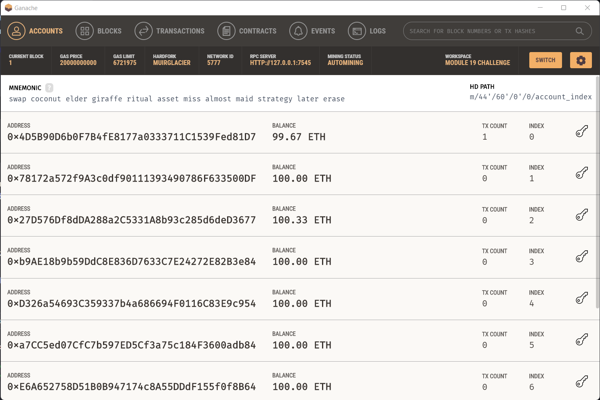
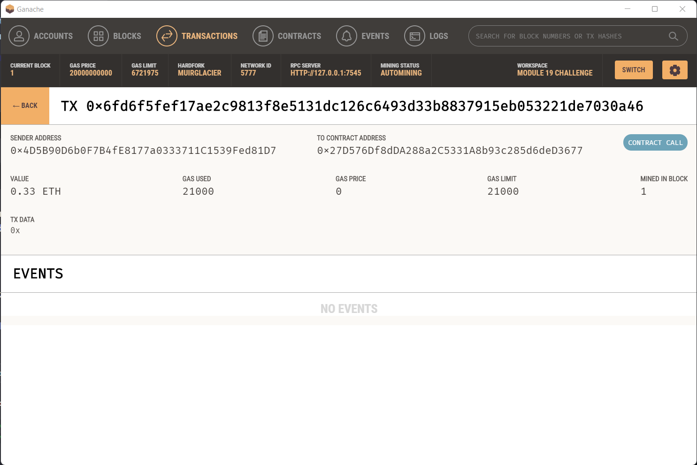

# Fintech Finder

This program makes it easy for a customer to hire potential FinTech professionals using Ethereum as a form of payment. Each candidate will have an asking hourly rate and past performance ratings are displayed on the webpage to ensure transparency.

Customers will be able to choose from a list of candidates that suit their needs and will be able to pay them instantly using Ethereum.

<br>

# Example Usage

The landing page of the FinTech finder web application:


<br>

The balance of the transactions in Ganache:


<br>

The history of one completed transaction:


<br>

# Usage

To run the program as a web application, use the following command:

```
streamlit run fintech_finder.py
```

From there, the user will be able to interact with the web application just like a normal webpage.